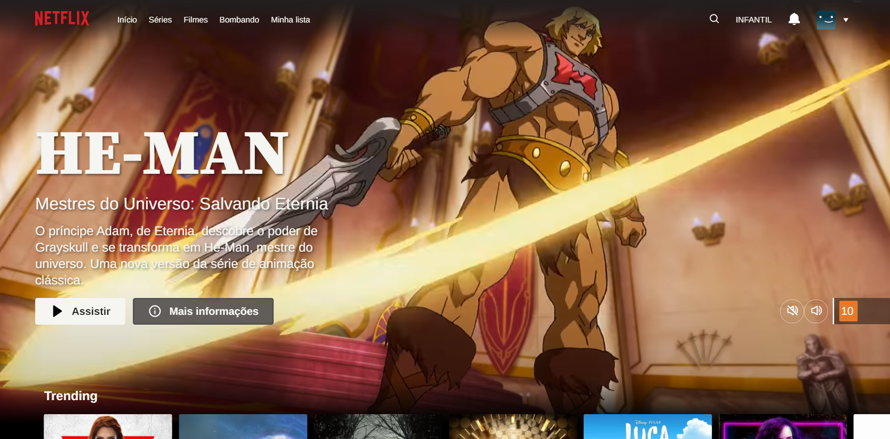
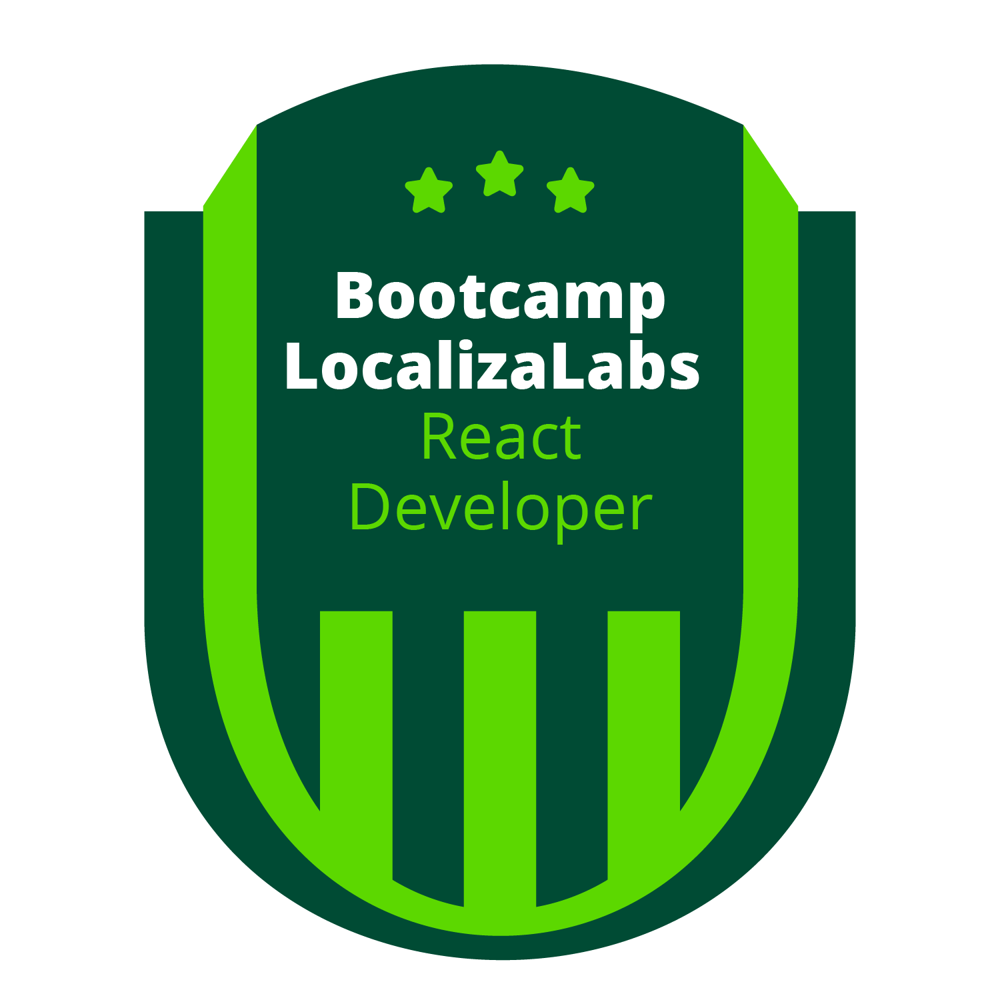

<h1 align="center">Netflix Clone</h1>
<h3 align="center">Projeto desenvolvido para a resolução do Desafio na plataforma Digital Innovation One.</h3>

<h3 align="center"> 

[Clique aqui para ver o projeto!](https://carolandrade1.github.io/netflix-clone/) </h3>

## 📺 Imagem

## 📚 Funcionalidades e Desafios

  - Design atualizado da pagina,
  - Pagina responsiva,
  - SASS,
  - JavaScript:
    - Request API TMDB(Ajax),
    - Seta para movimentar o slider,
    - Gerar slider,
    - Alterar background do header após movimento da página,
    - Botões para interagir com o video,
    - Data atualizada automaticamente no footer.
 
  * Como foi a primeira vez que utilizei API, tive bastante ajuda para conseguir fazer/aprender sobre o request. A funcionalidade dos botões não está exatamente como deveria, mas como ainda não aprendi jQuery, foi a solução que encontrei.

  * Por causa de pré-requisitos de alguns navegadores, o video inicia sem som, e caso queira escutar o trailer, só ativa-lo no botão.  

## 💻 Linguagens e tecnologias utilizadas

 
     

## 📂 Referencias

  - [Site Netflix](https://www.netflix.com/)
  - [TMDB API](https://www.themoviedb.org/)
  - [jQuery.getJSON()](https://api.jquery.com/jquery.getjson/)
  - [Boxicons](https://boxicons.com/)

## ⏳ Bootcamp 

MRV Front End SPA Developer

LocalizaLabs React Developer
